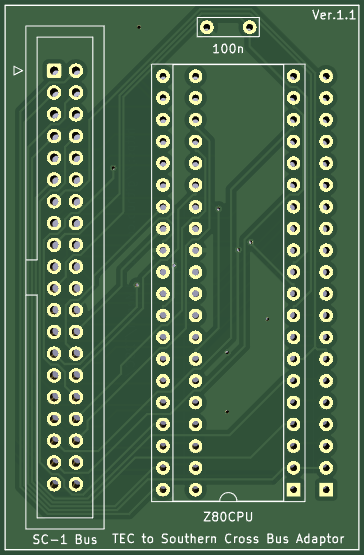

# T2SC

TEC to Southern Cross SC-1 Bus Adaptor 

A small KICad project to Adapt the Talking Electronics TEC-1 computer to the IO expansion bus used by the Southern Cross SC-1, Microprofessor MPF-1 and similar computers.

This allows any SC-1 or MPF-1 expansion device to be fitted to the TEC-1. This adaptor does not resolve any issues with IO port ranges or memory maps - however it provides a 'good start' in terms of interfacing.

The SC-1 products on this github are also built with the TEC-1 in mind and will generally work fine as-is using this adaptor, or with minor changes.

## How it works

In short, this adaptor simpy breaks out the Z80 CPU's 40 pins directly to an IO connector. There is no buffering, it is a straight signal path. Hence, this adaptor can be used with ANY Z-80 CPU based system - not just the computers mentioned here.

Note the orientation of the connectors has been done deliberately to ensure the IDC cable is passed off 'to the left', which is the same as the SC-1. This arrangement requires all the Z-80 signals to be 'swapped end for end' as the TEC's Z-80 is orientated opposite to the SC-1.

The IDC connecor pin numbering has been done in an unconventional "antclockwise" approach, to match the CPU pin numbering. Don't let the ping numbering bother you too much; as long as the physical pin to PCB pad order is understood, then matching devices can be easily built.

### Southern Cross Bus Connector

The SC-1 schematics and PCB have undergone several revisons, but the bus connector has always remained the same, even though the pin nunbering and connector orientation labelling has been shown differently on various revisions. The v3.2 revision is correct.

The following schematic snippet is taken from Craig Jones SC-1 repository at https://github.com/crsjones/Southern-Cross-Computer-z80/tree/main/SouthernCrossSBC_PCB_R32 and shows the current, correct orientation (PCB version 3.2). Note that earlier PCB revisions show the connector incorrectly orientated (flipped 180 degrees); however the PCB pads to Z-80 layout are always correct and have never changed on any PCB version.

### MPF-1 Bus Connector

Note the different pin numbering convention, but the actual pin locations are identical.

#### Relevant Links

TEC-1 github [https://github.com/tec1group]

SC-1 github [https://github.com/crsjones/Southern-Cross-Computer-z80]

TEC-1 and SC-1 Facebook Group [https://www.facebook.com/groups/tec1z80]
